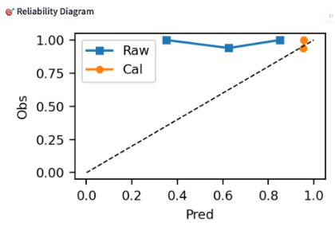
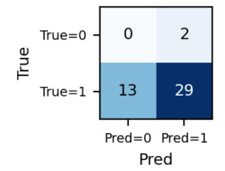
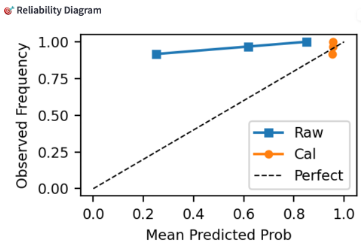
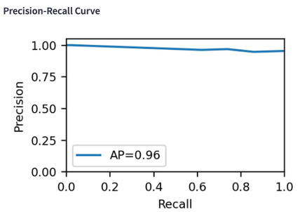
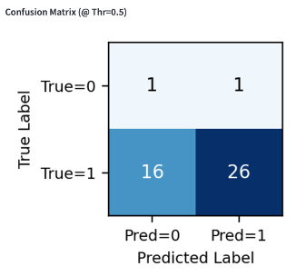
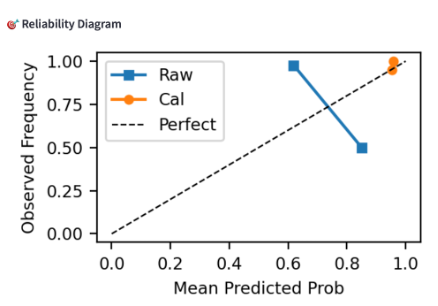
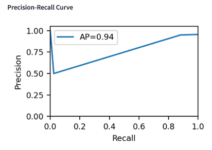
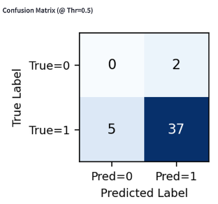

# Forecasting U.S. Political Events with GDELT + LLMs

This project builds an **LLM-powered event forecasting pipeline** that predicts whether **Protests**, **Strikes**, or **Attacks** will occur in the **United States** in the *next week*, using the **GDELT** event database and **GPT-4** reasoning over weekly summaries.

The pipeline:
1. Ingests and cleans U.S. political events from GDELT
2. Aggregates events into **weekly summaries**
3. Prompts an LLM to produce a **probability forecast (0–1)** + short rationale
4. Evaluates performance (precision/recall/F1/AUC/Brier) and **calibrates probabilities**
5. Visualizes everything in a **Streamlit dashboard** (metrics + curves + rationales)

(Full method details are in `project_report.pdf`.)

---

## What This Predicts

For each calendar week (Mon–Sun), the model predicts:

> **Probability that at least one {protest | strike | attack} event occurs next week**

Domains are configured by event root codes + thresholds in `config.py`.
- protest: roots 18–19
- strike: root 17
- attack: roots 20–29  
(See `DOMAINS` in `config.py`.)

---

## Repository Contents (Key Files)

- `ingest_us_political_events.py`  - Pulls U.S. events from **GDELT BigQuery** and saves to CSV.
- `data_cleaning.py`  -  Chunked cleaning (drops missing fields, validates coords, keeps required columns).
- `prune_data.py`  -  Reduces dataset / filters to what the pipeline needs.
- `data_loader.py`  -  Loads cleaned data and creates weekly summaries (used by evaluation).
- `forecast.py`  -  Calls GPT-4 to return `{ "prob": <float>, "why": <short rationale> }`.
- `evaluate.py`  -  Runs forecasting over weeks, computes metrics, calibrates with logistic regression, writes outputs.
- `dashboard.py`  -  Streamlit dashboard reading prediction CSVs and rendering metrics, reliability plots, PR/ROC, confusion matrices.

---

## Outputs

After running `evaluate.py`, the project writes:
- `predictions_expl_protest.csv`
- `predictions_expl_strike.csv`
- `predictions_expl_attack.csv`

Each contains per-week:
- `week`
- `raw_prob`
- `raw_pred`
- `summary` (weekly top events)
- `explanation` (LLM rationale)
- `true` (ground truth label)
- `cal_prob`, `cal_pred` (if calibration is possible)

The dashboard also expects:
- `domain_positive_rates.csv` (if generated in your pipeline; dashboard references it)

---

## 📈 Results & Evaluation

The forecasting system was evaluated on **weekly U.S. political event data** across three domains: **protests**, **strikes**, and **attacks**.

### Key Results
- Achieved **high precision** across all domains, indicating strong reliability when predicting the occurrence of events.
- **Average Precision (AP)** exceeded **90%** for protest and strike prediction, showing effective ranking of high-risk weeks.
- **Brier scores** indicate reasonably well-calibrated probability estimates, further improved through **logistic regression calibration**.
- Calibration curves show that post-calibration probabilities better align with empirical event frequencies.
- LLM-generated rationales consistently referenced **recent event trends, intensity, and geographic spread**, providing interpretable justifications for predictions.

To better understand model performance across different event types, we present **domain-specific evaluation plots** for **Protests**, **Attacks**, and **Strikes**.  
Each domain includes three high-signal plots:
- **Reliability (Calibration) Diagram**
- **Precision–Recall Curve**
- **Confusion Matrix**

These visualizations highlight both **predictive accuracy** and **probability calibration**.

---

### 🪧 Protest Forecasting Results





---

### 💥 Attack Forecasting Results





---

### ✊ Strike Forecasting Results





---

## Tech Stack

- Python 3.9+
- Data: `pandas`, `numpy`
- Modeling/Eval: `scikit-learn`
- Viz: `matplotlib`
- Dashboard: `streamlit`
- LLM: `openai`
- Ingestion: `google-cloud-bigquery`, `python-dotenv`

---

## ⚙️ Setup and Run Instructions

### Step 1: Clone the Repository

```bash
git clone https://github.com/<your-username>/gdelt-event-forecasting.git
cd gdelt-event-forecasting
```

---

### Step 2: Create and Activate Virtual Environment

```bash
python -m venv .venv
source .venv/bin/activate    # macOS/Linux
# .venv\Scripts\activate     # Windows
```

---

### Step 3: Install Dependencies

```bash
pip install pandas numpy matplotlib scikit-learn streamlit python-dotenv openai google-cloud-bigquery
```

---

### Step 4: Configure Environment Variables

```bash
export OPENAI_API_KEY="YOUR_OPENAI_API_KEY"
export GOOGLE_APPLICATION_CREDENTIALS="/path/to/service_account_key.json"
export BIGQUERY_PROJECT="your-gcp-project-id"
```

---

### Step 5: Configure Project Settings

Open `config.py` and verify:
- Dataset paths
- Domain definitions
- Environment variable usage

---

### Step 6: Ingest U.S. Political Events from GDELT

```bash
python ingest_us_political_events.py
```

---

### Step 7: Clean the Raw Data

```bash
python data_cleaning.py
```

---

### Step 8: Prune the Dataset

```bash
python prune_data.py
```

---

### Step 9: Generate Forecasts and Evaluate Performance

```bash
python evaluate.py
```

Generated files:
- `predictions_expl_protest.csv`
- `predictions_expl_strike.csv`
- `predictions_expl_attack.csv`

---

### Step 10: Launch the Streamlit Dashboard

```bash
streamlit run dashboard.py
```

Open the local URL shown in the terminal (usually `http://localhost:8501`).

---

## 📄 License

This project is intended for educational and research purposes only.
